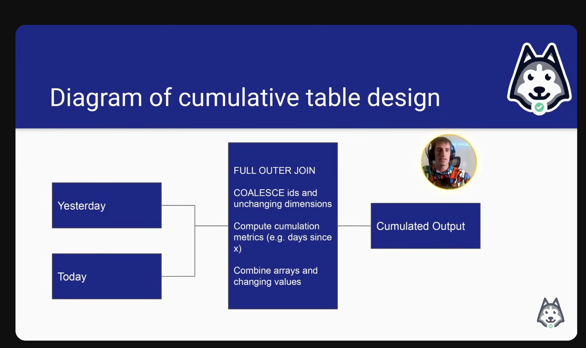

# Data dimension

#### What is dimension?

* dimensions are attributes of an entity.&#x20;
* some of dimensoins may IDENTIFY an entity (e.g. Defect's ID)
* otheres are just attributes

Dimensions are in 2 types

* Slowly-changing : attributes that changes over time (e.g. favorite foods)
* Fixed : Phone's manufacturer (e.g. Phone's manufacturer)

Knowing your data consumer

* Data Analyst/Data Scientists
  * Easy to query
* Other Data Engineer&#x20;
  * When other data engineers use your data for their data pipeline
* ML models
  * Identifier, and flat
  * similar to data scientist consumers
* Customers
  * Very easy, no data modelling or excel

OLTP vs master vs OLAP

* OLTP(online transaction processing)
  * low latency, low volume
  * 3rd data normalization, minimize data duplication
* OLAP(online analytical processing)&#x20;
  * Optimized for large volume, GROUP BY queries, minimize JOINS
  * Good chunk of data&#x20;
* Master Data&#x20;
  * Optimizes for completeness of entity definitions
  * middle of OLAP & OLTP

OLTP and OLAP is a continuum

Step1: Production Database Snapshots (from OLTP)

Step2: Master Data

* dedup
* Master Data join over 40 tables to integrate data from OLTP.

Step3: OLAP Cubes

* GROUP BY, (by country, by devices)
* slice and dice for analytics&#x20;

Step4: Metrics

Cumulative Table Design

* Holding on to history
* 2 data frames (yesterday and today)&#x20;
* FULL OUTER JOIN two data frames
* COALESCE values to keep everything around???

Usage of cumulative table design

* growth analytics at Facebook
* State transition tracking (if users are active yesterday, but not today, lots of transitions over time)

Diagram of cumulative table design

* Today's data will be an input to tomorrow's yesterday table.
* Easy "transition" analysis
* Drawbacks
  * Can only be backfilled sequentially
    * **Relies on yesterday's data, cannot backfill parallely.**&#x20;
  * PII data can be hard since deleted/ inactive users get carried forward&#x20;
* My insight
  * Initially thought that Bug tracking solution table could be designed as cumulative table
  * But bug tracking solution is not about continuously monitoring everlasting entity.
  * Bug will be resolved or deleted, within certain timeframe.&#x20;
  * No need to cumulatively input the data.

<figure><figcaption></figcaption></figure>

The compactness vs usability tradeoff

* The most usable tables usually
  * No complex data types
  * Easily manipulated with WHERE and GROUP By
* The most compact tables(not human readable)
  * compressed to be as small&#x20;
  * since network I/O is the most expensive
  * e.g. Consumers highly technical
* middle-ground tables
  * JSON, ARRAY data types
  * e.g. Upstream staging/ master data

Struct vs Array vs Map

* Struct
  * never heard about this
  * Table in table
  * keys are rigidly defined, compression is good
* Map
  * keys are loosely defined
  * Values all have to be the same type
* Array
  * ordinal
  * list of values that all have to be the same type

Temporal Cardinality Explosion of Dimensions

Temporal : information that is associated with time&#x20;

* will organize later when I understand this concept.

### SCD (Slowly Changing Dimensons)&#x20;

Idempotency

* Regardless day/ hour run it&#x20;
* Regardless how many times

What can causs pipeline NOT IDEMPOTENT

* INSERT INTO without TRUNCATE
  * MERGE or INSERT OVERWRITE is recommended
  * **Personally, did not know about this option when adding another row.**
* Using start\_date without a corresponding end\_date <&#x20;
  * specify window of dates you want to insert
*   Not using full set of partition sensors

    * pipeline run with only no/partial data

* Not using depends\_past for cumulative pipelines
  * pipeline should remain \*sequential\*, when cumulative
* Relying on "latest" partition of not properly modelled SCD
  * ONLY properly modeled SCD is allowed to rely on 'latest partition'&#x20;
* Relying on "latest" partition of anything else

Risk&#x20;

* Backfilling inconsistencies with old data & re-stated data
* If pipeline is not idempotent, unit test cannot replicate the production behaviour

When to use SCD?

* The creator of airflow says SCD sucks, never should be used.
* What are the alternatives?
  * latest snapshot
  * Daily/Monthly/Yearly Snapshot
  * SCD
* How slowly are the SCD changing?&#x20;
  * Slower the better

How can you model dimensions that change?&#x20;

* Latest Snapshot
  * worst modelling, will damage Idempotency when backfilled
* Daily partitioned snapshots
* SCD 1,2,3

Types of SCD

* Type 0
  * Dimensions that are not changed
  * e.g. Birthdays
* Type 1
  * only care the latest value
  * The pipeline will not be idempotent.&#x20;
* Type 2
  * you care about the value from 'start date' and 'end date'
  * Current values usually have either end\_date of "NULL" or '9999-12-31'
  * Since there is more than 1 row per dimension, you need to be careful for filtering
* Type 3
  * Only care about 'original' and 'current value'
  * Benefits
    * Only hold 1 row
    * whereas SCD Type 2 have multiple rows everytime the dimension changes.&#x20;
  * Drawbacks
    * Lose history between original and current data
  * Is this idempotent?
    * Partially, which means not.
    * Backfilling will cause difference

Summary

* **Only focus on Type 0, Type 2**

<figure><figcaption></figcaption></figure>

How to load SCD2?&#x20;

1. All at once?&#x20;

* 1 query and you are done

2. Incrementally load the data after the previous SCD is generated

* Has some 'depends\_on\_past' constraint
* efficient but cumbersome

